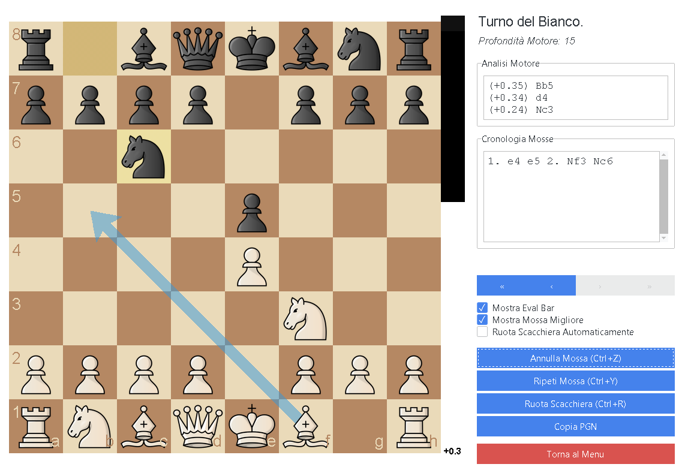

# App scacchi desktop



## Descrizione

Questa è una semplice applicazione desktop per giocare a scacchi sviluppata in Python. Utilizza Stockfish come motore per valutare le posizioni e per effettuare le mosse quando si gioca contro il computer.

## Caratteristiche

- **Modalità di gioco**: Gioca con un amico, contro il computer o computer vs computer
- **Barra di valutazione**: Visualizza la valutazione della posizione con possibilità di attivare/disattivare
- **Indicatore della mossa migliore**: Mostra la mossa migliore suggerita dal motore
- **Rotazione automatica della scacchiera**: La scacchiera si gira automaticamente in base al turno
- **Undo/Redo**: Annulla o ripristina le mosse effettuate
- **Navigazione mosse**: Naviga avanti e indietro tra le mosse della partita
- **Disegno frecce**: Disegna frecce sulla scacchiera per visualizzare strategie
- **Indicatore mosse legali**: Visualizza le mosse legali per ogni pezzo
- **Interazione intuitiva**: Muovi i pezzi con click o drag and drop
- **Analisi post-partita**: Analisi completa delle mosse con valutazione e accuratezza complessiva

## Tecnologie Utilizzate

- **Python**: Linguaggio di programmazione principale
- **Pygame**: Libreria per l'interfaccia grafica e la gestione degli eventi
- **python-chess**: Libreria per la gestione della logica degli scacchi
- **Stockfish**: Motore scacchistico per l'analisi e le mosse del computer

## Struttura del Progetto

```
Chess_App/
│
├── assets/                          # Risorse grafiche
│   ├── pieces/                      # Immagini dei pezzi degli scacchi
│   └── classifications/             # Icone per la classificazione delle mosse
│
├── engine/                          # Motore Stockfish
│   └── stockfish.exe
│
├── src/                             # Codice sorgente principale
│   ├── analysis/                    # Moduli per l'analisi delle partite
│   │   ├── accuracy_calculator.py  # Calcolo dell'accuratezza
│   │   ├── advanced_move_classifier.py  # Classificazione avanzata delle mosse
│   │   ├── attackers_defenders.py  # Analisi attaccanti/difensori
│   │   ├── critical_moves.py       # Identificazione mosse critiche
│   │   ├── danger_levels.py        # Livelli di pericolo
│   │   ├── piece_safety.py         # Sicurezza dei pezzi
│   │   └── piece_trapped.py        # Rilevamento pezzi intrappolati
│   │
│   ├── core/                        # Logica principale del gioco
│   │   ├── game_logic.py           # Logica del gioco
│   │   └── stockfish_manager.py    # Gestione del motore Stockfish
│   │
│   ├── ui/                          # Componenti dell'interfaccia utente
│   │   └── ui_components.py        # Componenti UI
│   │
│   ├── utils/                       # Utilità varie
│   │   └── utils.py                # Funzioni di utilità
│   │
│   ├── config.py                    # Configurazioni dell'applicazione
│   └── main.py                      # Entry point dell'applicazione
│
├── main.py                          # File principale per avviare l'app
├── requirements.txt                 # Dipendenze Python
└── README.md                        # Questo file
```

## Requisiti

- Python 3.8 o superiore
- Sistema operativo: Windows, macOS o Linux

## Installazione

```bash
pip install -r requirements.txt
```

## Come Eseguire l'Applicazione

```bash
python main.py
```

## Controlli

- **Click sinistro**: Seleziona e muovi i pezzi
- **Drag and drop**: Trascina i pezzi per muoverli
- **Click destro + trascina**: Disegna frecce sulla scacchiera
- **Pulsanti UI**: Utilizza i pulsanti nell'interfaccia per undo/redo, navigazione mosse, e altre funzionalità

## To Do

- Sistemare la valutazione delle mosse nell'analisi post partita
